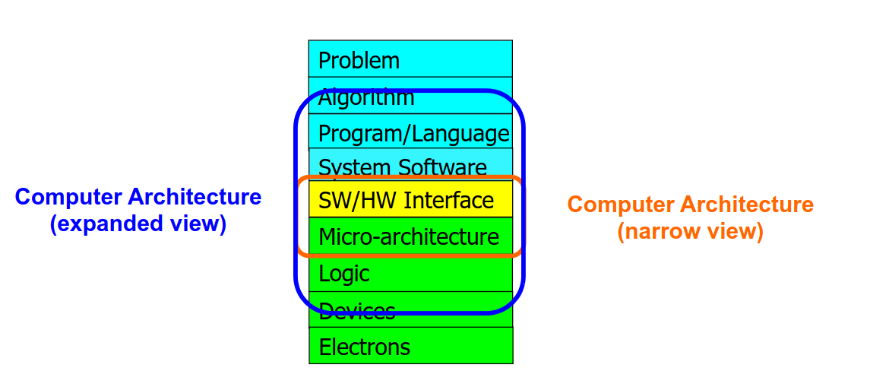
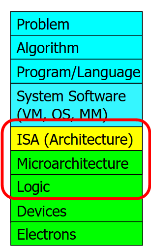

# Lecture1 Intro

## 当前的四个关键方向

* ***安全，可靠***的体系结构
* ***节能***的体系结构
* ***低延迟和可预测***的体系结构
* AI/ML，基因学，药学，健康，....等领域的专用体系结构

## DDCA的目标和结构

1. 将要学到***计算机是怎样工作的***
2. 目标
   * 理解基础
   * 理解设计的原则
   * 理解前人的设计
3. 基于上述理解
   * 学习一个现代计算机底层工作原理
   * 评估不同设计和想法的权衡
   * 实现原则性设计（一个简单的微处理器）
   * 学习为日渐复杂的系统做系统的debug
   * ***希望能够发展出新颖的设计***
4. 为什么有这些目标
   * 设计更好的硬件，软件，系统
   * 在设计中做更好的权衡
   * 理解计算机的行为
   * 更好的解决问题
   * 批判的思考

## The Transformation Hierarchy

1. 我们为什么要计算？为了解决生活中遇到的问题，获得新的认识
2. 计算机怎么解决问题？协同工作的电子管
3. 问题解决的办法
   * 
   * 
   *  算法：解决问题的一系列步骤（有穷，无二义性，可执行）
   * ISA:软件和硬件的接口
   * Microarchitecture: ISA的一种实现方式
   * 数字逻辑电路：micro-arc的建设模块（如门电路）

4. 计算机体系结构
   * 是设计计算平台的科学和艺术（硬件，接口，系统，编程方式）
   * 为了达成一系列的设计目的
5. ***不同的平台，不同的目标，设计不同的体系结构***

## 当前计算机体系结构中有趣的事情

* 性能，能效，可持续
* 可靠性，安全性，隐私性
* 更多有需要的工作流
* 新的技术

***这些需要用扩展的视角看计算机体系结构，依据设计目的，权衡性能，安全性等因素***

## 一个概念

以计算为中心：数据存储在其他地方，在需要的时候送至处理器计算然后写回到存储器。

以数据为中心：存储和计算的耦合程度更高（直接在数据层面做计算）

目的是为了减少数据的移动（数据移动耗时，耗能大）